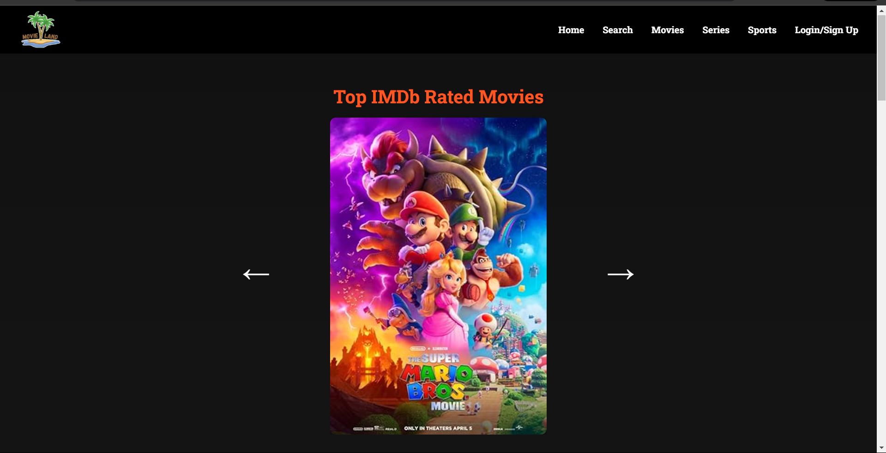
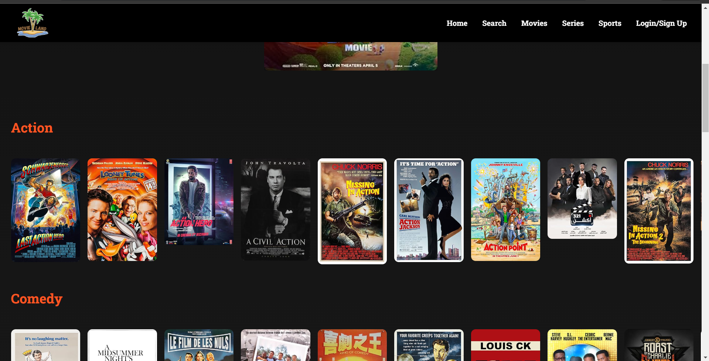
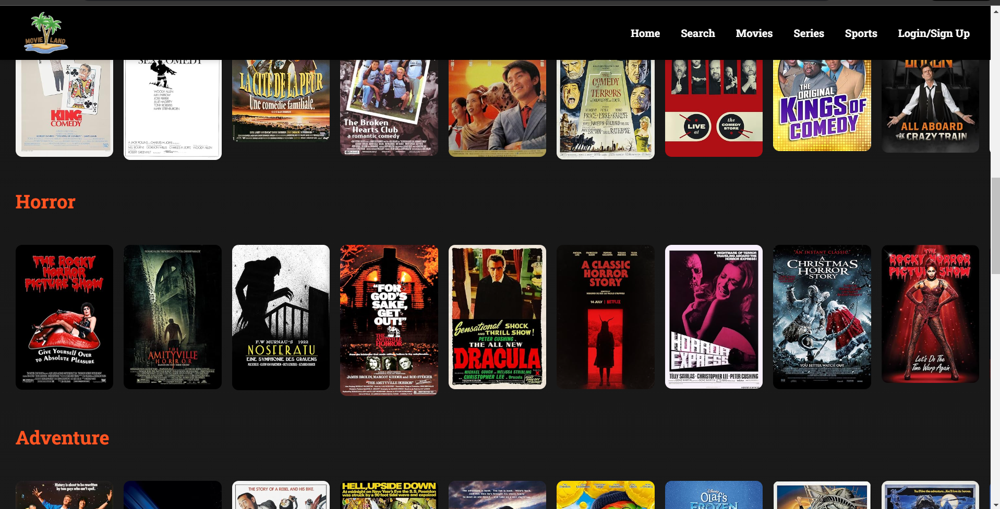
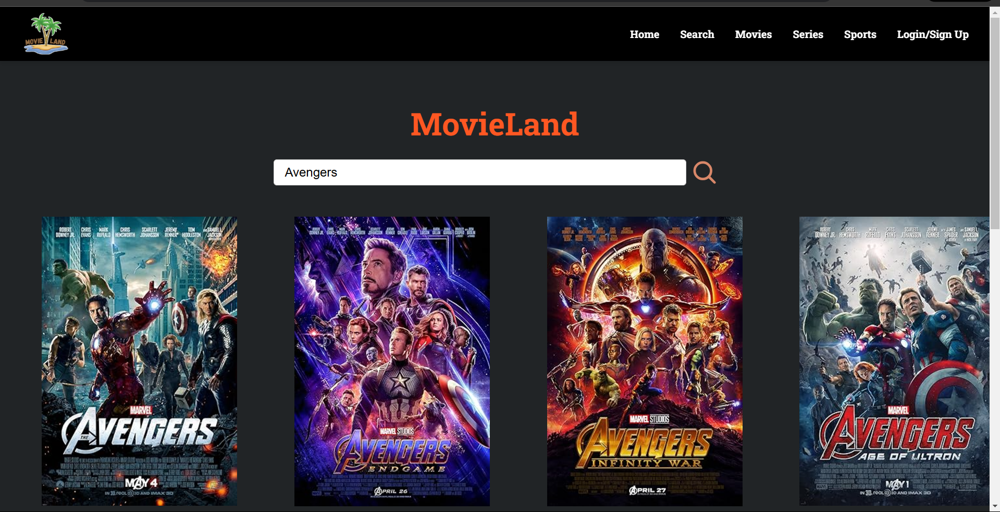
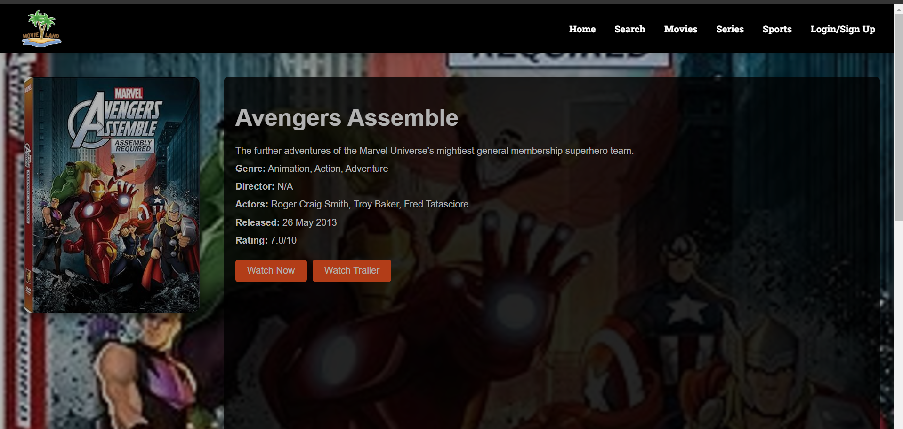
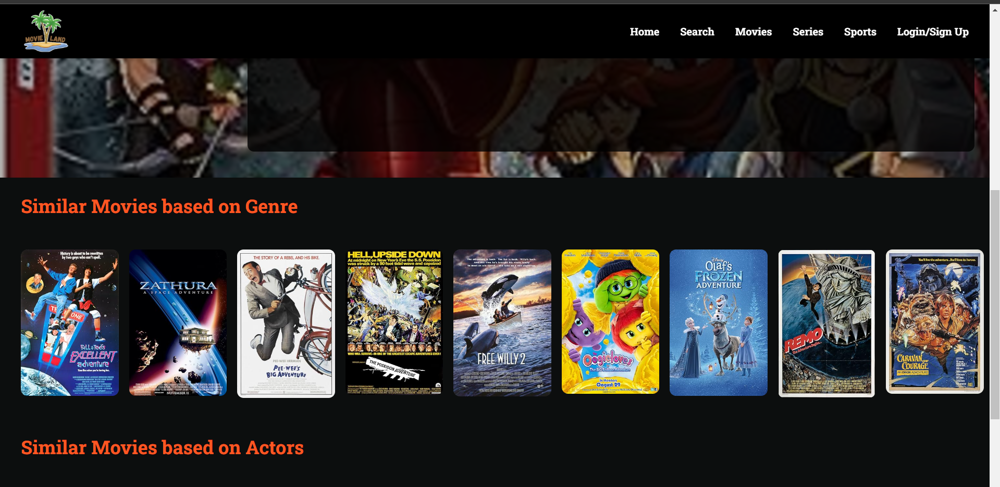

# MovieLand

A web application for discovering and exploring movies, genres, and movie details.

## About the Project

MovieHub is a user-friendly platform designed for movie enthusiasts. Users can search for movies, browse genres, view detailed movie information, and manage their profiles with a login/signup system.

## Technologies Used

**Frontend**: React, React Router 
**Styling**: CSS (custom styling with flexbox and grid) 
**API**: OMDB API for fetching movie data 
**Font Libraries**: Google Fonts (Roboto Slab and Raleway)

## Installation and Setup

Clone the repository: 
`git clone https://github.com/OmKashyap5/MovieLand.git` 
Navigate to the project directory: 
`cd MovieLand` 
Install dependencies: 
`npm install` 
Start the development server: 
`npm start` 
Open your browser and navigate to http://localhost:3000.

## Usage

**Homepage**: Access a carousel with popular movies. 
**Search Movies**: Use the search bar to find movies; results are displayed in a grid format. 
**Explore Genres**: View movies by genre. 
**Movie Details**: Click on a movie to view its details. 
**Login/Signup**: Manage user authentication.

## **NOTE:**
Make sure to enter your API key in the files wherever mentioned <enter_your_api_key>. 
You can get the API key used here by visiting (https://www.omdbapi.com/).

## Website images
### Home Page

